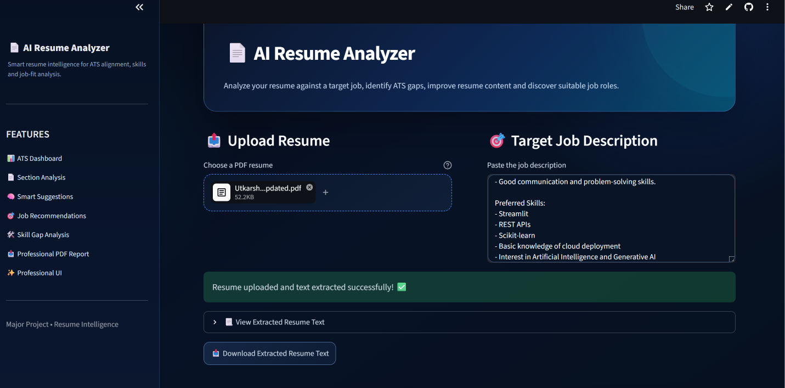
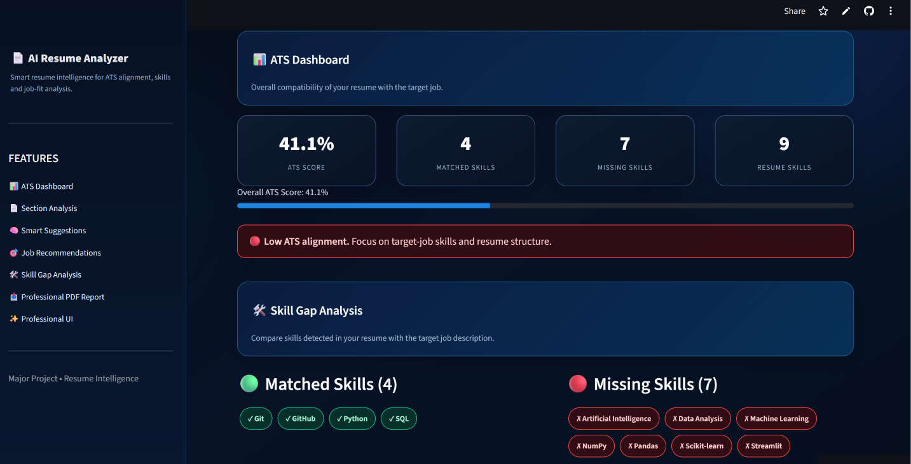
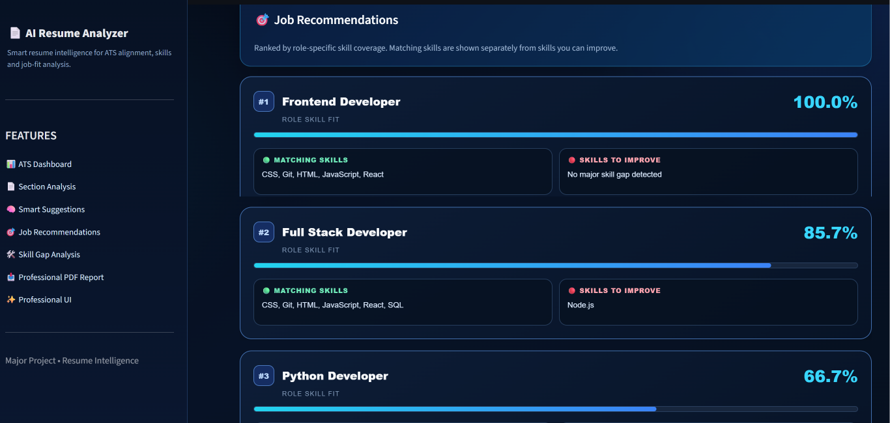

# 🤖 AI Resume Analyzer

An AI-powered Resume Analyzer built with **Python and Streamlit** that helps users analyze their resume against a target job description.

The application evaluates the resume, identifies skill gaps, provides improvement suggestions, recommends suitable job roles, and generates a downloadable PDF report.

## 🌐 Live Demo

👉 https://utkarsh-airesume-analyzer.streamlit.app/

## ✨ Features

- 📄 Upload Resume in PDF format
- 🎯 Analyze Resume against a Target Job Description
- 📊 ATS Score Analysis
- 🔍 Skill Gap Detection
- 💡 Smart Resume Improvement Suggestions
- 💼 Job Recommendations
- 📑 Downloadable PDF Report
- 🎨 Professional and User-Friendly UI

## 🧠 Resume Analysis

The application analyzes the uploaded resume and provides:

- ATS compatibility score
- Resume section analysis
- Skill matching
- Missing skills
- Skill gap analysis
- Resume improvement suggestions

## 🔍 Skill Gap Analysis

Identifies skills required by the target job that are missing or insufficiently represented in the resume.

## 💡 Smart Suggestions

Provides actionable recommendations to improve the resume and increase its relevance to the target job.

## 💼 Job Recommendations

Suggests suitable job roles based on the resume profile and analyzed skills.

## 📄 PDF Report

Generates a downloadable PDF report containing the resume analysis results.

## 🛠️ Tech Stack

- 🐍 Python
- 🎈 Streamlit
- 📄 PDF Processing
- 📊 Data Analysis
- 🧠 Natural Language Processing
- 📑 ReportLab

## 💻 Run Locally

Clone the repository:

```bash
git clone https://github.com/utkarsh77-prog/AI_RESUME_ANALYZER.git
cd AI_RESUME_ANALYZER
```

Install the required dependencies:

```bash
pip install -r requirements.txt
```

Run the Streamlit application:

```bash
streamlit run app.py
```

## 📸 Project Screenshots

### 🏠 AI Resume Analyzer Dashboard



### 📊 Resume Analysis & Skill Gap



### 💼 Job Recommendations & PDF Report



## 👨‍💻 Project

**AI Resume Analyzer**  
Built using Python, Streamlit, NLP, PDF Processing and ReportLab.
